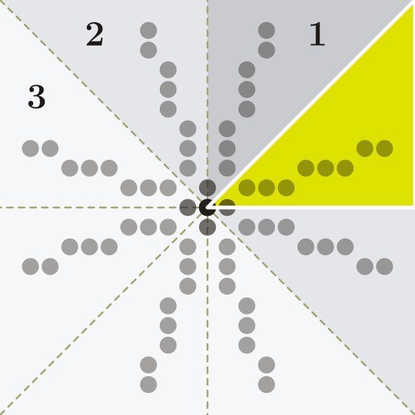

# Laboratorium 2.: Algorytmy rasteryzacji linii

### Uwaga! Commitujemy po każdym zadaniu! Należy poprawnie skonfigurować pola username/email swojego klienta gita!

Celem laboratorium jest implementacja algorytmów rasteryzacji w naszym prostym software'owym rendererze. Zacznij od otworzenia projektu z repozytorium w swoim ulubionym środowisku programistycznym (IDE). Projekt ma następującą strukturę:

```text
CGlab
└── README.md
└── LAB02.md
└── src
|   └── main
|       └── java
|           └── CGlab
|               └── App.java
|               └── Renderer.java
└── (...)
```

Projekt ma też dołączone pliki Gradle do ułatwienia procesu kompilacji (można to wykonywać w łatwy sposób z konsoli, zakładając że Gradle jest zainstalowany w systemie).

Całość kodu odpowiedzialna za renderowanie grafiki powinna znaleźć się w klasie Renderer. App zawiera funkcję ```main``` i będzie obsługiwać parametry podawane przez użytkownika, a także inne zadania (np. wczytanie modelu 3D). Na razie kod klas wygląda następująco:

```text
CGlab/src/main/java/CGlab/App.java
```


```java
package CGlab;

import java.io.IOException;
import java.util.logging.Level;
import java.util.logging.Logger;

public class App {

    String version = "0.02";

    public static void main(String[] args) {

        Renderer mainRenderer = new Renderer(System.getProperty("user.home")+"/render.png");
        mainRenderer.clear();
        mainRenderer.drawPoint(100, 100);
        try {
            mainRenderer.save();
        } catch (IOException ex) {
            Logger.getLogger(App.class.getName()).log(Level.SEVERE, null, ex);
        }
    }

    public String getVersion() {
    return this.version;
    }
}
```

oraz 

```text
CGlab/src/main/java/CGlab/Renderer.java
```

```java
package CGlab;


import java.awt.Graphics2D;
import java.awt.image.BufferedImage;
import java.io.File;
import java.io.IOException;
import javax.imageio.ImageIO;

public class Renderer {

    public enum LineAlgo { NAIVE, BRESENHAM, BRESENHAM_INT; }

    private BufferedImage render;
    public final int h = 200;
    public final int w = 200;

    private String filename;
    private LineAlgo lineAlgo = LineAlgo.NAIVE;

    public Renderer(String filename) {
        render = new BufferedImage(200, 200, BufferedImage.TYPE_INT_ARGB);
        this.filename = filename;
    }

    public void drawPoint(int x, int y) {
        int white = 255 | (255 << 8) | (255 << 16) | (255 << 24);
        render.setRGB(x, y, white);
    }

    public void drawLine(int x0, int y0, int x1, int y1, LineAlgo lineAlgo) {
        if(lineAlgo == LineAlgo.NAIVE) drawLineNaive(x0, y0, x1, y1);
        if(lineAlgo == LineAlgo.BRESENHAM) drawLineBresenham(x0, y0, x1, y1);
        if(lineAlgo == LineAlgo.BRESENHAM_INT) drawLineBresenhamInt(x0, y0, x1, y1);
    }

    public void drawLineNaive(int x0, int y0, int x1, int y1) {
        // TODO: zaimplementuj
    }

    public void drawLineBresenham(int x0, int y0, int x1, int y1) {
        // TODO: zaimplementuj
    }

    public void drawLineBresenhamInt(int x0, int y0, int x1, int y1) {
        // TODO: zaimplementuj
    }

    public void save() throws IOException {
        File outputfile = new File(filename);
        render = Renderer.verticalFlip(render);
        ImageIO.write(render, "png", outputfile);
    }

    public void clear() {
        for (int x = 0; x < w; x++) {
            for (int y = 0; y < h; y++) {
                int black = 0 | (0 << 8) | (0 << 16) | (255 << 24);
                render.setRGB(x, y, black);
            }
        }
    }

    public static BufferedImage verticalFlip(BufferedImage img) {
        int w = img.getWidth();
        int h = img.getHeight();
        BufferedImage flippedImage = new BufferedImage(w, h, img.getColorModel().getTransparency());
        Graphics2D g = flippedImage.createGraphics();
        g.drawImage(img, 0, 0, w, h, 0, h, w, 0, null);
        g.dispose();
        return flippedImage;
    }
}
```


Klasa ```Renderer``` ma pola przechowujące wysokość (```h```) i szerokość (```w```) obrazu, a także ścieżkę do pliku, do którego będzie zapisywany efekt renderowania. Karta graficzna zapisuje obraz do bufora ramki (a stamtąd trafia on na ekran), jednak tutaj nie będziemy renderować do ekranu (ani nawet konkretnego okna), a dla uproszczenia do pliku. Interesuje nas efekt działania algorytmów grafiki komputerowej - powstały w wyniku ich działania obraz, który najwygodniej jest zapisać do pliku z rozszerzeniem PNG (na co pozwala metoda ```save```). Pozostałe metody to:

- ```clear``` - zeruje obraz (wynikiem jest obraz z wszystkimi pikselami ustawionymi na kolor czarny)
- ```drawPoint``` - zamalowywuje wskazany piksel obrazu na kolor biały,
- ```drawLine``` - będzie odpowiadać za rysowanie linii (na razie pusta),
- ```verticalFlip``` - ponieważ BufferedImage ma punkt (0,0) w lewym górnym rogu, a na potrzeby laboratorium chcemy pracować z układem odniesienia obrazu w lewym dolnym rogu, to obraz przed zapisem trzeba "przerzucić" (odbić). Metoda jest wywoływana automatycznie przed zapisem i nie trzeba o tym fakcie pamiętać - zakładamy że punkt (0,0) jest w lewym dolnym rogu obrazu.

Klasa ```App``` tworzy instancję Renderera, rysuje biały punkt na środku obrazu i zapisuje go. Zauważ, że w obecnej postaci, kod nie pozwala użytkownikowi na wybór lokalizacji pliku (jest ustawiona "na sztywno" w kodzie), to samo dotyczy rozmiaru obrazu.

#### Zadanie 1.: Zmień kod klasy App tak, aby użytkownik przy uruchamianiu programu z linii poleceń mógł zdefiniować ścieżkę do renderowanego pliku oraz jego wymiary ```w``` oraz ```h```, w tej kolejności. Należy skorzystać z ```String[] args```. Parametry powinny być oddzielone spacjami, np.:

```
/home/student/Desktop/grafika/renderer.png 640 480
```

---

Zadanie rysowania linii można zrealizować używając naiwnego algorytmu zmiennoprzecinkowego. Algorytm ten, znając współczynnik kierunkowy prostej, na której leży odcinek do narysowania, wyznacza piksele przybliżające odcinek przez zaokrąglanie współrzędnych do najbliższej liczby całkowitej (zobacz Wykład 2., Rysunek 5). 

#### Zadanie 2.: Uzupełnij kod metody  ```drawLineNaive```  tak, aby realizował rysowanie linii wyżej opisanym algorytmem. 

#### Zadanie 3.: Zmodyfikuj kod programu tak, aby pozwolić użytkownikowi na wybór algorytmu, który będzie używany do rysowania linii. Pole za to odpowiedzialne (```lineAlgo```) powinno być ustawiane przez konstruktor klasy ```Renderer``` na podstawie parametru podawanego przez użytkownika, przykładowo uruchomienie programu z parametrami:

```
renderer.png 640 480 LINE_NAIVE
```

#### będzie renderować grafikę do pliku renderer.png o rozmiarach 640x480, przy rysowaniu linii wykorzystując naiwny zmiennoprzecinkowy algorytm rysowania linii.

---

Rozważmy teraz algorytm rysowania linii wg. Bresenhama - pozwala on uniknąć kosztownych operacji mnożenia i zaokrąglania. Jego postać przedstawiona na wykładzie, przeniesiona do Javy mogłaby wyglądać następująco:

```java
    public void drawLineBresenham(int x0, int y0, int x1, int y1) {
        int white = 255 | (255 << 8) | (255 << 16) | (255 << 24);

        int dx = x1-x0;
        int dy = y1-y0;
        float derr = Math.abs(dy/(float)(dx));
        float err = 0;

        int y = y0;

        for (int x=x0; x<=x1; x++) {
            render.setRGB(x, y, white);
            err += derr;
            if (err > 0.5) {
                y += (y1 > y0 ? 1 : -1);
                err -= 1.;
            }
        } // Oktanty: 
    }
```

Kod ten nie działa dla wszystkich odcinków, przykładowo nie rysuje linii gdy x1 < x0. Możemy przyjąć, że będziemy musieli rysować następujące przypadki linii (zakładamy, że na rysunku środkowy punkt to x0):



<sub><sup>źródło: Wikimedia Commons / Phrood / CC BY-SA</sup></sub>

Kod powinien działać poprawnie dla przypadku w 8. oktancie (zaznaczonym na żółto) oraz w jeszcze jednym.

#### Zadanie 4: Dodaj powyższy kod do swojego Renderera. W funkcji ```main``` przygotuj kilka wywołań funkcji dla różnych parametrów i sprawdź wynikowe obrazy. Dla których oktantów kod ten działa poprawnie? Uzupełnij komentarz ```// Oktanty: ``` o numery tych, dla których leżące w nich linie rysują się poprawnie. Numery oddziel przecinkiem.

---

 Algorytm rysowania w aktualnej postaci w pętli nie potrzebuje mnożenia, dzielenia czy zaokrąglania, lecz wciąż działa na liczbach zmiennoprzecinkowych: ```float derr```, ```float err```.

 #### Zadanie 5: Zmodyfikuj algorytm tak, aby działał na liczbach całkowitych (patrz slajdy z wykładu 2.). Kod umieść w metodzie: ```drawLineBresenhamInt```. Uwzględnij wszystkie przypadki rysowania odcinka (każdy z oktantów). Przetestuj swoje rozwiązanie.
