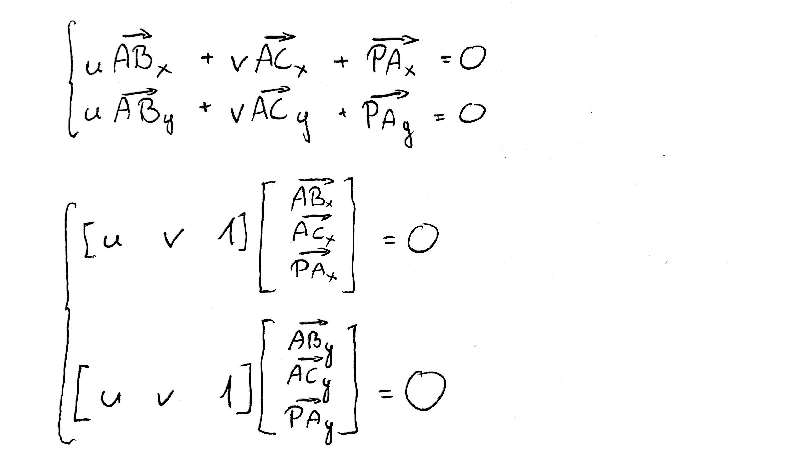

# Laboratorium 3.: Wypełnianie trójkątów

### Uwaga! Commitujemy po każdym zadaniu! Należy poprawnie skonfigurować pola username/email swojego klienta gita!

Celem laboratorium jest implementacja algorytmu wypełniania trójkątów za pomocą współrzędnych barycentrycznych. Na laboratorium dodamy także funkcjonalność wczytywania modelu z pliku OBJ.


Z wykładu wiemy, że położenie punktu względem wierzchołków trójkąta można opisać za pomocą współrzędnych barycentrycznych. Wystarczy traktować jego boki jako wektory bazowe specjalnego układu współrzędnych, a jeden z wierzchołków jako początek tego układu:


Porzucimy sobie tutaj znane z wykładu oznaczenia w postaci liter greckego alfabetu i wprowadzimy zamiast tego ```v``` i ```u```, które można wygodnie użyć jako nazwa zmiennej. Z rysunku widzimy, że położenie punktu P można opisać za pomocą liniowej kombinacji wektorów AB i AC względem punktu A.

Ponieważ mamy tutaj wektory, rozpiszmy to za pomocą poszczególnych ich elementów i notacji z nawiasami kwadratowymi:



Mamy dwie niewiadome i dwa równania. Co więcej, jeśli iloczyn tych wektorów w poszczególnych równaniach ma wynosić 0, to z algebry wiemy, że muszą być one prostopadłe do siebie. Zwróćmy uwagę też na pewien fakt: szukamy współrzędnych ```u``` i ```v``` wektora, takch, żeby oba pozostałe wektory były do niego prostopadłe. Możemy skorzystać z definicji iloczynu wektorowego.

Wróćmy do naszego kodu.

---


#### Zadanie 1.: Dodaj do projektu kod poniższych klas (uzupełniony o konstruktory ustawiające pola współrzędnych):

```java
public class Vec3i {
    public int x;
    public int y;
    public int z;

    @Override
    public String toString() {
        return x + " " + y + " " + z;
    }    
}

public class Vec3f {
    public float x;
    public float y;
    public float z;
    @Override
    public String toString() {
        return x + " " + y + " " + z;
    }
}

public class Vec2f {
    public float x;
    public float y;
    @Override
    public String toString() {
        return x + " " + y;
    }
}

public class Vec2i {
    public int x;
    public int y;
    @Override
    public String toString() {
        return x + " " + y;
    }
}

```

Klasy te pozwolą na bardziej przejrzystą implementację. Oczywiście powinny trafić do odpowiedniego katalogu z plikami źródłowymi.

---

Do wypełniania trójkątów będziemy potrzebować 2 metod:

- ```barycentric``` - oblicza i zwraca współrzędne (u, v, 1-u-v) barycentryczne punktu P względem trójąta ABC,
- ```drawTriangle``` - dla każdego piksela sprawdza czy punkt leży wewnątrz trójkąta (na podstawie jego wsp. baryc., patrz wykład), jeśli tak to zamalowywuje go.

#### Zadanie 2.: Uzupełnij kod metody  ```barycentric```  tak, aby realizował obliczanie współrzędnych barycentrycznych i dodaj ją do klasy Renderer.


```java
public Vec3f barycentric(Vec2f A, Vec2f B, Vec2f C, Vec2f P) {
     Vec3f v1 = // tutaj potrzebujemy wektora składającego się ze współrzędnych
                // x wektorów AB, AC ora PA. 

     Vec3f v2 = // tutaj potrzebujemy wektora składającego się ze współrzędnych
                // y wektorów AB, AC ora PA. 

     Vec3f cross = // iloczyn wektorowy v1 i v2. Wskazówka: zaimplementuj do tego oddzielną metodę

     Vec2f uv = // wektor postaci: cross.x / cross.z, cross.y / cross.z

     //
     Vec3f barycentric = // współrzędne barycentryczne, uv.x, uv.y, 1- uv.x - uv.y
    return barycentric;
} 
```

#### Zadanie 3.: Dodaj do programu kod metody ```drawTriangle``` uzupełniony o procedurę wypełniania trójkąta:

```java
public void drawTriangle(Vec2f A, Vec2f B, Vec2f C) {
    // dla każdego punktu obrazu this.render:
    //      oblicz współrzędne baryc.
    //      jeśli punkt leży wewnątrz, zamaluj (patrz wykład)
} 
```
#### Przetestuj jej działanie na przykładowych trójkątach, które zdefiniujesz w klasie App.


#### Zadanie 4: Rozszerz metodę rysowania trójkątów o możliwość zmiany koloru, który powinien być 4. parametrem typu Vec3i a jego pola (x,y,z) powinny odpowiadać wartościom kanałów (R,G,B). Na początku metody dokonaj sprawdzenia czy kolor ustawiony jest poprawnie, ewentualnie przytnij go do przedziału <0,255>.

---

Powyższe rozwiązanie nie jest efektywne - sprawdzamy wszystkie punkty obrazu dla każdego rysowanego trójkąta, mimo że mogą być one znacznie oddalone od niego i nie wymagane jest liczenie współrzędnych barycentrycznych aby stwierdzić, czy należą one do trójkąta.

#### Zadanie 5: Zmodyfikuj kod rysowania trójkątów tak, aby sprawdzać tylko punkty obrazu należące do prostokąta który można opisać na trójkącie (tzw. bouding-box).

---


