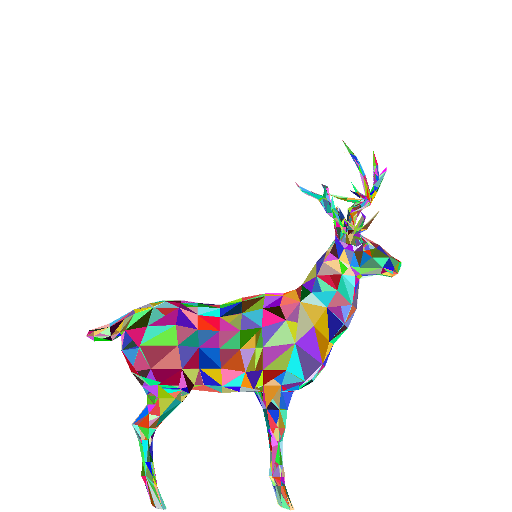
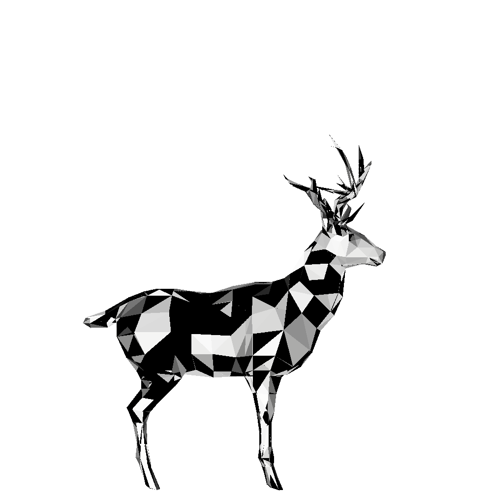
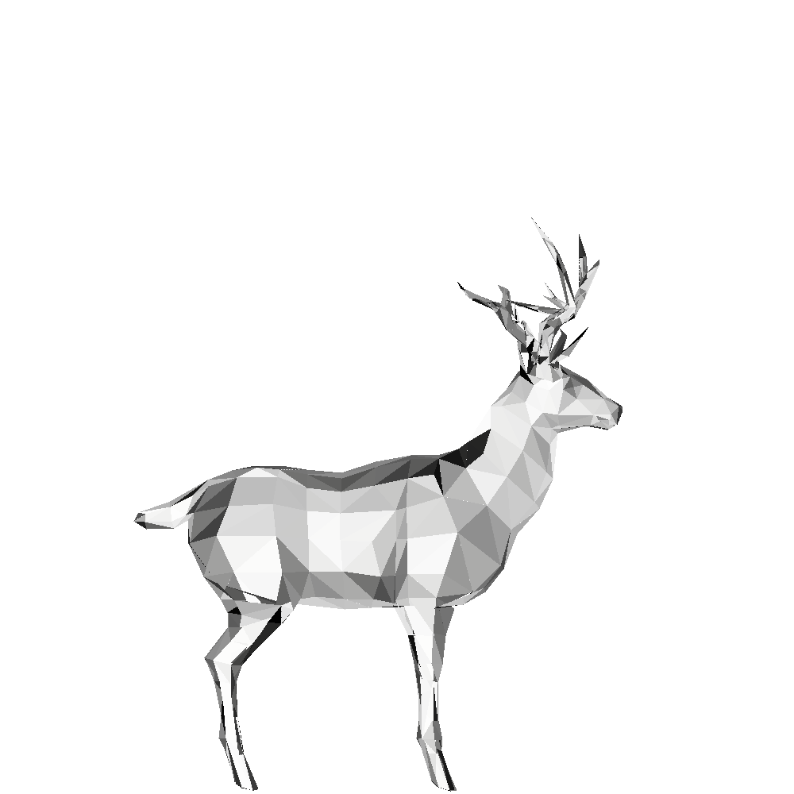

# Laboratorium 4.: Flat shading. Test z-bufora.


### Uwaga! Commitujemy po każdym zadaniu! Należy poprawnie skonfigurować pola username/email swojego klienta gita!


Kod projektu, od którego należy zacząć dzisiejsze laboratorium, został rozszerzony o dwie klasy:
- ```Model``` - obsługuje wczytywanie modelu 3D obiektu z pliku .obj
- ```RandomColorRenderer``` - umożliwia renderowanie rzutowanego na płaszczyznę (rzutowanie równoległe prostokątne) modelu 3D; każda ściana modelu otrzymuje losowy kolor.

Klasa do wczytywania modelu OBJ wygląda następująco:

```java

package CGlab;
import java.io.*;
import java.util.ArrayList;
import java.util.List;

public class Model {
    private ArrayList < Vec3f > vertexList;
    private ArrayList < Vec3i > faceList;
    public Model() {}

    public List < Vec3i > getFaceList() {
        return faceList;
    }
    public Vec3f getVertex(int index) {
        return vertexList.get(index);
    }

    public void readOBJ(String path) throws IOException {
        vertexList = new ArrayList < > ();
        faceList = new ArrayList < > ();
        InputStream objInputStream = new FileInputStream(path);
        BufferedReader reader = new BufferedReader(new InputStreamReader(objInputStream));
        vertexList.add(new Vec3f(0, 0, 0));
        while (reader.ready()) {
            String line = reader.readLine();
            if (isVertex(line)) vertexList.add(parseVertexFromOBJ(line));
            else if (isFace(line)) faceList.add(parseFaceFromOBJ(line));
        }
    }

    private boolean isVertex(String line) {
        return line.charAt(0) == 'v' && line.charAt(1) == ' ';
    }

    private boolean isFace(String line) {
        return line.charAt(0) == 'f' && line.charAt(1) == ' ';
    }
    
    private Vec3f parseVertexFromOBJ(String line) {
        String[] splitted = line.split(" "); // will be {"v", xcord, ycord, zcord} return new Vec3f( Float.parseFloat(splitted[1]), Float.parseFloat(splitted[2]),
        Float.parseFloat(splitted[3]);
        return new Vec3f( Float.parseFloat(splitted[1]), Float.parseFloat(splitted[2]), Float.parseFloat(splitted[3]));
    }

    private Vec3i parseFaceFromOBJ(String line) {
        String[] splitted = line.split(" "); // "f" will be first, than 3 x vertex_index/texture_index/normal_index

        return new Vec3i(Integer.parseInt(splitted[1].split("/")[0]), Integer.parseInt(splitted[2].split("/")[0]),
                Integer.parseInt(splitted[3].split("/")[0])); // we need to split based on "/" to get vertex_index
    }
}

```

Klasa ta wczytuje model z pliku OBJ, a właściwie jego wierzchołki i wielokąty (faces) z których się składa. Klasa nie obsługuje wczytywania wektorów normalnych modelu, ani wczytywania współrzędnych tekstur. Zakłada też, że wszystkie wielokąty modelu są trójkątami, więc poprawnie wczytywane są tylko modele uprzednio poddane triangulacji (na takich będziemy pracować).

Klasa ```RandomColorRenderer```:

```java 

package CGlab;


import java.util.concurrent.ThreadLocalRandom; 

public class RandomColorRenderer extends Renderer {

    public RandomColorRenderer(String filename) { super(filename);
    }
    public RandomColorRenderer(String filename, int w, int h) { super(filename, w, h);
    }
    public void render(Model model) {
        for (Vec3i face : model.getFaceList()) {

            Vec2i[] screen_coords = new Vec2i[3];
            Vec3f[] world_coords = new Vec3f[3];

            world_coords[0] = model.getVertex(face.x);
            world_coords[1] = model.getVertex(face.y);
            world_coords[2] = model.getVertex(face.z);

            for (int j=0; j<3; j++) {
                screen_coords[j] = new Vec2i((int)((world_coords[j].x + 1.0) * render.getWidth() / 2.0),
                                          (int)((world_coords[j].y + 1.0) * render.getHeight() / 2.0) - render.getHeight() / 2);
            }
            int randColor = ThreadLocalRandom.current().nextInt(0, 0x00ffffff) | 0xff000000;
            drawTriangle(screen_coords[0], screen_coords[1], screen_coords[2], randColor);
        }
    }
}

```

pozwala na przekazanie obiektu klasy Model do metody render i rysuje go, ustawiając kolor ściany na losowy. 

**Klasa ```RandomColorRenderer``` dziedziczy po rozwijanej na wcześniejszych laboratoriach klasie ```Renderer``` i jej implementacja 
przygotowana jest z założeniem, że w klasie nadrzędnej poprawnie zaimplementowano metodę do rysowania trójkątów (```drawTriangle```) 
z opcją ustawienia koloru rysowania (czwarty parametr typu int).***

W efekcie możemy otrzymywać takie rendery (plik wejściowy: deer-mod.obj):



**Zadanie 1.: Dodaj do projektu kod powyższych klas i przetestuj działanie.**

Do wypełniania trójkątów powinniśmy zastosować coś bardziej realistycznego niż losowy kolor. Prostym przykładem metody, której można użyć jest tzw. flat-shading czyli cieniowanie ścian w następujący sposób:
- ściana która jest prostopadła do wektora światła - biała,
- ściana na którą nie pada światło - czarna,
- pozostałe proporcjonalnie.


**Zadanie 2.: Stwórz klasę FlatShadingRenderer która będzie cieniować ściany w sposób opisany powyżej. Przykładowy rezultat:**



Na tym rysunku mamy niepoprawny rezultat rysowania - niektóre trójkąty wydają się pochodzić z niewidocznej dla obserwatora strony modelu a jednak są wyrysowane. Aby poprawnie narysować model należy zastosować tzw. *backface-culling* czyli odrzucić te ściany które są zwrócone tyłem do kamery. Możemy sprawdzić to, licząc iloczyn skalarny wektora normalnego ściany i wektora kamera-trójkąt. Jeśli iloczyn jest większy lub równy 0, ściany nie rysujemy.

**Zadanie 3.: Dodaj do metody ```render``` mechanizm *backface-culling*.**



Ukrywanie niewidocznych ścian to nie wszystko, chcemy mieć możliwość poprawnego rysowania obiektów się przysłaniających - jeśli z punktu widzenia obserwatora jakieś 2 obiekty przysłaniają się, to obiekty znajdujące się z tyłu powinny pozostać całkowicie lub częściowo niewidoczne, a na obrazie w tym miejscu pojawi się najbliższy obserwatorowi obiekt. Najwydajniejszym sposobem na sprawdzenie, co powinno zostać wyrysowane jest test z-buffora. Do testu z-buffora możesz potrzebować:

- tablicy 2-wymiarowej typu float(lub double)  o rozmiarach obrazu
- modyfikacji metody renderującej trójkąt o wyliczanie głębi (z) piksela na podstawie współrzędnych (z) wierzchołków i współrzędnych barycentrycznych piksela.

**Zadanie 4.: Dodaj do projektu mechanizm testu z-buffora. Umieść go w nadrzędnej klasie Renderer**

Poprawnie renderowany model po usunięciu niewidocznych ścian i zastosowaniu testu z-buffora:


**Zadanie 5.: Dodaj do projektu (do klasy Model) metodę translate() która przyjmuje obiekt Vec3f i przesuwa model o ten wektor (modyfikuje wszystkie wierzchołki). Następnie wyrysuj 2 modele (jeden przesunięty po osi X i Z) i sprawdź czy otrzymujesz taki sam rezultat renderowania niezależnie od kolejności rysowania modeli**


